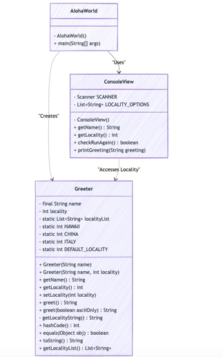

# Homework Aloha World Report

The following report contains questions you need to answer as part of your submission for the homework assignment. 

## Design Doc
Please link your UML design file here. See resources in the assignment on how to
link an image in markdown. You may also use [mermaid] class diagrams if you prefer, if so, include the mermaid code here.  You DO NOT have to include Greeting.java as part of the diagram, just the AlohaWorld application that includes: [AlohaWorld.java], [Greeter.java], and [ConsoleView.java].

classDiagram

class AlohaWorld {
- AlohaWorld()
+ main(String[] args)
  }

class ConsoleView {
- Scanner SCANNER
- List~String~ LOCALITY_OPTIONS
- ConsoleView()
+ getName() String
+ getLocality() int
+ checkRunAgain() boolean
+ printGreeting(String greeting)
  }

class Greeter {
- final String name
- int locality
- static List~String~ localityList
- static int HAWAII
- static int CHINA
- static int ITALY
- static int DEFAULT_LOCALITY
+ Greeter(String name)
+ Greeter(String name, int locality)
+ getName() String
+ getLocality() int
+ setLocality(int locality)
+ greet() String
+ greet(boolean asciiOnly) String
- getLocalityString() String
+ hashCode() int
+ equals(Object obj) boolean
+ toString() String
+ getLocalityList() List~String~
  }

AlohaWorld --> ConsoleView : "Uses"  
AlohaWorld --> Greeter : "Creates"  
ConsoleView --> Greeter : "Accesses Locality"

### Program Flow
Write a short paragraph detailing the flow of the program in your own words. This is to help you understand / trace the code (and give you practice of something called a code walk that will be required in this course).

The program starts in the AlohaWorld class. It first asks the user for their name and location using methods from the ConsoleView class. Then, it creates a Greeter object with this information and gets a greeting from the Greeter, then use ConsoleView to display the greeting. This process repeats until the user answered "n" or "no". Each class has its job: ConsoleView handles user input and output, Greeter creates greetings, and AlohaWorld runs the program.

## Assignment Questions

1. List three additional java syntax items you didn't know when reading the code.  (make sure to use * for the list items, see example below, the backtick marks are used to write code inline with markdown)
   
   * (example) `final class`
   * `Scanner.nextLine()`
   * `trim()`
   * `String.format()`

2. For each syntax additional item listed above, explain what it does in your own words and then link a resource where you figured out what it does in the references section. 

    * (example) The `final` keyword when used on a class prevents the class from being subclassed. This means that the class cannot be extended by another class. This is useful when you want to prevent a class from being modified or extended[^1] . It is often the standard to do this when a class only contains static methods such as driver or utility classes. Math in Java is an example of a final class[^2] .
    * The `Scanner.nextLine()` is used to read an entire line of input from the user, including spaces[^3].
    * The `trim()`is used to removes the leading and trailing spaces from a string, and rest of the string remain unchanged[^4]. 
    * The `String.format()` this method allows user to create a formatted string using placeholders for values.  [^5].

3. What does `main` do in Java?  
   * 'main' is a method that the Java virtual machine looks for and call while running a java application. The main () method serves as the entry point for program execution. When the program start to execute, the JVM calls main() to begin execution, this method act as foundation of a program, arrange how components interact to achieve the desired functionality.

4. What does `toString()` do in Java? Why should any object class you create have a `toString()` method?
   * The toString() method in Java turns an object into a readable string that describes it. Adding a toString() method makes debugging and logging easier and ensures that objects are more readable when printed.

    

5. What is javadoc style commenting? What is it used for?  
   The Javadoc style commenting is standardized as write comments in java that start with /**, and end with */. Javadoc comments are processed by the Javadoc tool to generate HTML documentation of the code that serves as a reference for developers. Javacode ensures that code is well-documented, at the same time, it is easier for others to read and understand the meaning of the code. 

    

6. Describe Test Driving Development (TDD) in your own words.  
    Test-Driven Development (TDD) is a way of building software where you write tests before writing the actual code. You start by creating a test for what the code should do, then write just enough code to make the test pass. Once the test passes, you can clean up or improve the code, repeating this process for each new feature or fix.

        

7. Go to the [Markdown Playground](MarkdownPlayground.md) and add at least 3 different markdown elements you learned about by reading the markdown resources listed in the document. Additionally you need to add a mermaid class diagram (of your choice does not have to follow the assignment. However, if you did use mermaid for the assignment, you can just copy that there). Add the elements into the markdown file, so that the formatting changes are reserved to that file. 

## Deeper Thinking Questions

These questions require deeper thinking of the topic. We don't expect 100% correct answers, but we encourage you to think deeply and come up with a reasonable answer. 

1. Why would we want to keep interaction with the client contained to ConsoleView?
   * Keep interacting with clients only in ConsoleView makes the program more organized and easier to manage. If user need to change how input or output works, user does not need to rewrite everything. This also keeps the rest of the code focused on logic and makes it easier to test and reuse.

2. Right now, the application isn't very dynamic in that it can be difficult to add new languages and greetings without modifying the code every time. Just thinking programmatically,  how could you make the application more dynamic? You are free to reference Geeting.java and how that could be used in your design.
    * We could follow the similar strategy as Greeting.java where we introduce the String.format to create a class that only pre-define the format of each greeting, like necessary components of a greeting. With this format, we allow user to set up their greeting words as an input while constructing this class, and this class will then apply their input language into the format of the string to generate the complete greetings.  

> [!IMPORTANT]
>  After you upload the files to your github (ideally you have been committing throughout this progress / after you answer every question) - make sure to look at your completed assignment on github/in the browser! You can make sure images are showing up/formatting is correct, etc. The TAs will actually look at your assignment on github, so it is important that it is formatted correctly.

## References

[^1]: Final keyword in Java: 2024. https://www.geeksforgeeks.org/final-keyword-in-java/. Accessed: 2024-03-30. 

[^2]: Math (Java Platform SE 17). https://docs.oracle.com/en/java/javase/17/docs/api/java.base/java/lang/Math.html. Accessed: 2024-03-30.

[^3]: https://www.geeksforgeeks.org/scanner-nextline-method-in-java-with-examples/. Accessed: 2025-01-23.

[^4]: https://www.geeksforgeeks.org/java-string-trim-method-example/. Accessed: 2024- 11-27. 

[^5]: https://www.geeksforgeeks.org/java-string-format-method-with-examples/. Accessed: 2025-01-04

<!-- This is a comment, below this link the links in the document are placed here to make ti easier to read. This is an optional style for markdown, and often as a student you will include the links inline. for example [mermaid](https://mermaid.js.org/intro/syntax-reference.html) -->
[mermaid]: https://mermaid.js.org/intro/syntax-reference.html
[AlohaWorld.java]: src/main/java/student/AlohaWorld.java
[Greeter.java]: src/main/java/student/Greeter.java
[ConsoleView.java]: src/main/java/student/ConsoleView.java